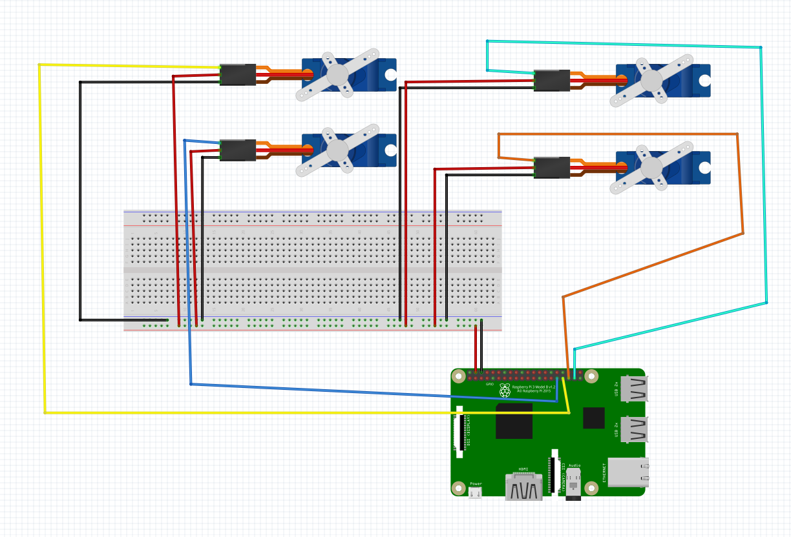
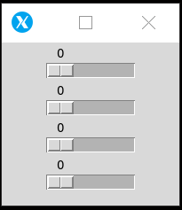

# MeARM_RaspberryPI
Control The MeARM using a RaspberryPi 3B/3B+ using Python (Tkinter)

The MEArm has 4 micro servo motors(sg90)

They are being controlled by Pulse Width Modulation(PWM)

The pinout in the Raspberry Pi is in BCM mode

The current version is already configured for the diagram attached


# Setup & Instructions
## Step 1:
## Display:
If you have an LCD display, make sure you have the drivers installed from this repository
```
https://github.com/goodtft/LCD-show
```
## No Display:
### For Linux Client:
No Configurtion required...Its already pre-configured
### For Windows Client:
Download a Xserver like Xming or X410:
Xming:
```
https://sourceforge.net/projects/xming/
```
X410:
Download from Windows Store!!
```
https://www.microsoft.com/en-us/p/x410/9nlp712zmn9q?activetab=pivot:overviewtab
```
### On the Client side:
Step 1: Run the Xserver program
Step 2: Open cmd (Start -> type "cmd" -> Hit Enter/Return Key
Step 3:  
```
ipconfig
```
Find the IP address of your current Wireless Device...(Say XX.XX.XX.XX)
### On the Raspberry Pi (Server side):
Note: Your might require a monitor/xrdp/Teamviewer Session
Step 1: Open a Terminal window
Step 2: Set the Display variable to forward the Interface to the Client(Laptop/Desktop you are currently working on)
```
DISPLAY=XX.XX.XX.XX:0
export DISPLAY
```
Step 3: Clone this git repository, cd(change directory into it, and run the python file
```
git clone https://github.com/1412kauti/MeARM_RaspberryPI.git
cd MeARM_RaspberryPI
python servo.py
```
## Step 2:
You are now presented by a small window on the left corner of your Client's Display



Enjoy !!

## Step N:
The GUI is highy modular, For instances of more than 4 motors, all you have to do is add a another variable like 
```
app5 = App(root, <pin_no>)
```
after the "Servo Control" part.
Add the new variable app5 = App(root, 5) ONLY AT THE END.
also
change the root.geometry() part, where the second dimension has to be incremented(increased)/decremented(decreased) as per the increase/decrease of the number of Slider in your setup.
an example is as follows:

This is for a 5 motor setup
```
root = Tk()

root.wm_title('Servo Control')
app = App(root,6)
app2 = App(root,13)
app3 = App(root, 19)
app4 = App(root, 26)
app5 = App(root, 5)
root.geometry("200x220+0+0")
root.mainloop()
```
Happy Robotics People !!

